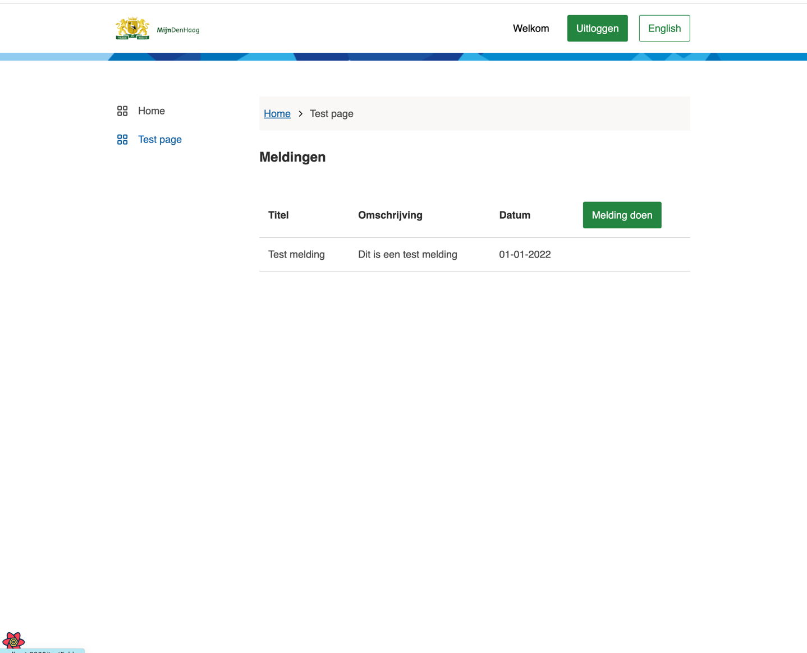
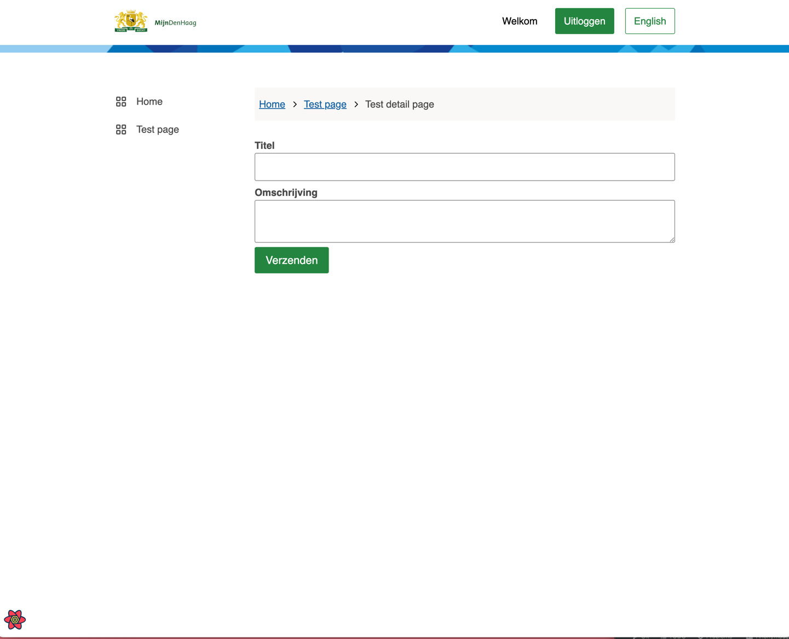

# Development of the Skeleton Application

This page consists of the following parts:

- Adding components
  - Add a table
  - Add a form
- API service

## _Adding components_

Now that we added the pages we can add components to it.
The components we are going to use are in the [conduction-components package](https://www.npmjs.com/package/@conduction/components) and the [gemeente-denhaag package](https://nl-design-system.github.io/denhaag/?path=/story/den-haag-introduction--page).
these packages are already included in `package.json` and can be used

In this guide I will show you how you can add a table on the main page and a form on the detail page.
After that we will tie it all together by posting the form and rendering the data in the table.

First add the table to `/src/templates/test/TestTemplate.tsx`.

```Javascript
//  /src/templates/test/TestTemplate.tsx
import * as React from "react";
import { Heading3 } from "@gemeente-denhaag/components-react";
import { Table, TableBody, TableCell, TableHead, TableHeader, TableRow } from "@gemeente-denhaag/table";

export const TestTemplate: React.FC = () => {
  return (
    <div>
      <div> 
        <Heading3>Meldingen</Heading3> 
        <Table>
          <TableHead>
            <TableRow>
              <TableHeader>Titel</TableHeader>
              <TableHeader>Omschrijving</TableHeader>
              <TableHeader>Datum</TableHeader>
              <TableHeader><Button>Melding doen</Button></TableHeader>
            </TableRow>
          </TableHead>
          <TableBody>
            <TableRow>
              <TableCell>Test melding</TableCell>
              <TableCell>Dit is een test melding</TableCell>
              <TableCell>01-01-2022</TableCell>
              <TableCell/>
            </TableRow>
          </TableBody>
        </Table>
      </div>
    </div>
  );
};
```

Now go to localhost:800 en click on the sideNav item 'Test page'.
You should see this:



Then add the form `/src/templates/test/TestDetailTemplate.tsx`

```Javascript
// /src/templates/test/TestDetailTemplate.tsx
import * as React from "react";
import { useForm } from "react-hook-form";
import { Button, FormField, FormFieldInput, FormFieldLabel } from "@gemeente-denhaag/components-react";
import { useTranslation } from "react-i18next";
import { InputText, Textarea } from "@conduction/components";

interface ITestDetail {
  title: string;
  description: string;
}

interface TestDetailProps {
  example?: ITestDetail;
}

export const TestDetailTemplate: React.FC<TestDetailProps> = ({ example }) => {
  const {
    register,
    handleSubmit,
    formState: { errors },
    setValue
  } = useForm();

  //the empty onSubmit is dependent on an API to function. This API is not yet implemented
  const onSubmit = async () => {};
  
  return (
    <form onSubmit={handleSubmit(onSubmit)}>
      <FormField>
        <FormFieldInput>
          <FormFieldLabel>Titel</FormFieldLabel>
          <InputText {...{ register, errors }} validation={{ required: true }} name="title" />
        </FormFieldInput>
      </FormField>
      <FormField>
        <FormFieldInput>
          <FormFieldLabel>Omschrijving</FormFieldLabel>
          <Textarea {...{ register, errors }} name="message" validation={{ required: true }} />
        </FormFieldInput>
      </FormField>
      <Button size="large" type="submit">
        Verzenden
      </Button>
    </form>
  );
};
```

Now we can link the table to the form
Edit the button in the table to: 

```Javascript
//  /src/templates/test/TestTemplate.tsx
<Button onClick={() => navigate("/testFolder/testDetail")}>Melding doen</Button>
```

Click on the button.
You should see this:



---

## _API Service_

To be able to send the form and to show the data in the table we need an api that can handle this.
In [this](https://github.com/CommonGateway/PetStoreAPI#running-the-api-with-the-skeleton-app) guide you can add an exiting API to the skeleton-app.
This guide also explains how to create an API with [Stoplight](https://stoplight.io/)

If we added the API we can create a `resource` in `/src/apiService/resources`
- add a file called `example.tsx` with the following code
  - we want to add a getAll and create function.

```Typescript
// /src/apiService/resource/example.ts
import { Send } from "../apiService";
import { AxiosInstance } from "axios";

export default class Example {
  private _instance: AxiosInstance;

  constructor(_instance: AxiosInstance) {
    this._instance = _instance;
  }

  public getAll = async (): Promise<any> => {
    const {
      data: { results },
    } = await Send(this._instance, "GET", "/notifications");

    return results;
  };

  public create = async (variables: { payload: any }): Promise<any> => {
    const { payload } = variables;
    const { data } = await Send(this._instance, "POST", "/notifications", payload);
    return data;
  };
}
```

- then go to `/src/apiService/apiService.ts`
  - here you need to add your resource

```Typescript
// /src/apiService/resource/example.ts
// Resources
import Example from "./resources/example";

// Resources
public get Example(): Example {
  return new Example(this.apiClient);
}
```

Now we want to create `hooks` for the error handling
- add a new page to `/src/hooks` with the following code:
```Typescript
// /src/hooks/example.ts
import * as React from "react";
import { QueryClient, useMutation, useQuery } from "react-query";
import APIService from "../apiService/apiService";
import { navigate } from "gatsby-link";
import { addItem } from "../services/mutateQueries";
import APIContext from "../apiService/apiContext";

export const useExample = (queryClient: QueryClient) => {
  const API: APIService = React.useContext(APIContext);

  const getAll = () =>
    useQuery<any[], Error>("examples", API.Example.getAll, {
      onError: (error) => {
        throw new Error(error.message);
      }
    });

  const create = () =>
    useMutation<any, Error, any>(API.Example.create, {
      onSuccess: async (newNotification) => {
        addItem(queryClient, "notifications", newNotification);
        navigate("/testFolder");
      },
      onError: (error) => {
        throw new Error(error.message);
      }
    });

  return { getAll, create };
};
```

Then we want to handle the form. 
Go to `/src/templates/test/TestDetailTemplate` and add/edit the following things
```Typescript
// /src/templates/test/TestDetailTemplate.tsx
const queryClient = useQueryClient();

const _useExample = useExample(queryClient);
const createExample = _useExample.create();

const {
  register,
  handleSubmit,
  formState: { errors },
  setValue
} = useForm();

React.useEffect(() => {
  example && handleSetFormValues(example);
}, [example]);

const handleSetFormValues = (formValues: ITestDetail): void => {
  setValue("title", formValues.title);
  setValue("description", formValues.description);
};

const onSubmit = (data: any) => {
  createExample.mutate({ payload: data });
};
```

// form created -> show result 
// ass queryclient to the table -> show the result