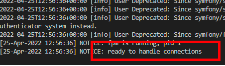

# Back end

Spinning up the backend in only needed in the following scenario's:

- ApiService
- Submitting forms
- Authenticating users

We integrated another open source project called [Common Gateway](https://github.com/ConductionNL/commonground-gateway) to authenticate and connect to APIs. This gateway allows us to define how to authenticate to external APIs and help with user authentication.

## Spinning up the back end

With the front-end running in `port:8000`, change directory out of the folder to the root of your repo. With Docker Desktop running, execute in the Command Line Interface:

```cli
docker-compose pull
docker-compose up
```

These commands will automatically download the containers needed for the application's backend. You will need to keep this running as well. If you are done developing the application, you can stop them in Docker Desktop.

Allow Docker the time to pull all the containers required. After a few minutes, the command line interface will display a `ready to handle connections` message in the CLI.
  

