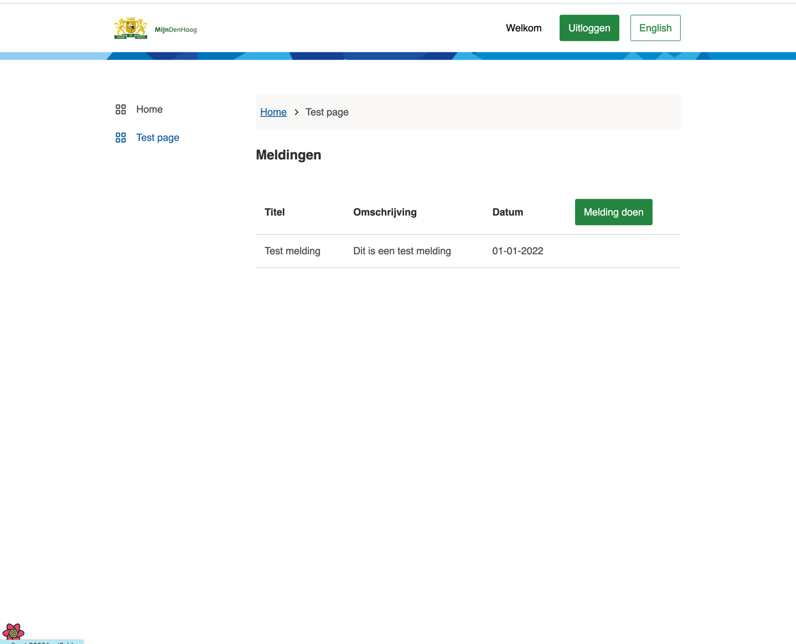

# Components

This page consists of the following parts:

- Using packages
- Adding components
  - Basic table
  - Basic form
  - Multistep form
  - Form.io
- API service

---

## _Using packages_

---
The Skeleton app is designed to be modular to save on development time. One of the aspects of this is the compatibility to use components developed by different players in various ecosystems. One of the NL Design System players is the municipality of The Hague. These components work exceptionally well with the PIP template.

Now, with added pages, let's add some components.

The components we're using are in the [conduction-components package](https://www.npmjs.com/package/@conduction/components) and the [gemeente-denhaag package](https://nl-design-system.github.io/denhaag/?path=/story/den-haag-introduction--page).
these packages are already included in `package.json` and can be used right away.

@TODO more info view, use, and add packages

---

## _Adding components_

---

This guide shows you how to add common page elements like tables and forms to your pages. After that, all will be tied together
by submitting the form and rendering the data in a table. Assuming imports are known to the readereadereader and React hooks and TypeScript interfaces. If any of the examples below are unclear, please revisit the requirements on the home page of the documentation or the [glossary](glossary.md).

---

### _Basic table_

---

First, let's add the table to `/src/templates/test/testDetailPage.tsx`. Doing this is like any other component with React and TypeScript.

```Javascript

//  /src/templates/test/testDetailPage.tsx
import * as React from "react";
import { Button, Heading3 } from "@gemeente-denhaag/components-react";
import { Table, TableBody, TableCell, TableHead, TableHeader, TableRow } from "@gemeente-denhaag/table";

export const HomeTemplate: React.FC = () => {
  return (
    <div>
      <div> 
        <Heading3>Meldingen</Heading3> 
        <Table>
          <TableHead>
            <TableRow>
              <TableHeader>Titel</TableHeader>
              <TableHeader>Omschrijving</TableHeader>
              <TableHeader>Datum</TableHeader>
              <TableHeader><Button>Melding doen</Button></TableHeader>
            </TableRow>
          </TableHead>
          <TableBody>
            <TableRow>
              <TableCell>Test melding</TableCell>
              <TableCell>Dit is een test melding</TableCell>
              <TableCell>01-01-2022</TableCell>
              <TableCell/>
            </TableRow>
          </TableBody>
        </Table>
      </div>
    </div>
  );
};

```

Navigate to `localhost:8000` en click on the sideNav item '[your-example-name] page'.
You should see this:



---

### _Basic form_

---

Then add the form `/src/templates/test/TestDetailTemplate.tsx`

```Javascript
// /src/templates/test/TestDetailTemplate.tsx
import * as React from "react";
import { useForm } from "react-hook-form";
import { Button, FormField, FormFieldInput, FormFieldLabel } from "@gemeente-denhaag/components-react";
import { useTranslation } from "react-i18next";
import { InputText, Textarea } from "@conduction/components";

interface ITestDetail {
  title: string;
  description: string;
}

interface TestDetailProps {
  example?: ITestDetail;
}

export const TestDetailTemplate: React.FC<TestDetailProps> = ({ example }) => {
  const {
    register,
    handleSubmit,
    formState: { errors },
    setValue
  } = useForm();

  //the empty onSubmit is dependent on an API to function. This API is not yet implemented
  const onSubmit = async () => {};
  
  return (
    <form onSubmit={handleSubmit(onSubmit)}>
      <FormField>
        <FormFieldInput>
          <FormFieldLabel>Titel</FormFieldLabel>
          <InputText {...{ register, errors }} validation={{ required: true }} name="title" />
        </FormFieldInput>
      </FormField>
      <FormField>
        <FormFieldInput>
          <FormFieldLabel>Omschrijving</FormFieldLabel>
          <Textarea {...{ register, errors }} name="message" validation={{ required: true }} />
        </FormFieldInput>
      </FormField>
      <Button size="large" type="submit">
        Verzenden
      </Button>
    </form>
  );
};
```

Now, to link the table to the form
Edit the button in the table to:

```Javascript
//  /src/templates/test/TestTemplate.tsx
<Button onClick={() => navigate("/testFolder/testDetail")}>Melding doen</Button>
```

Click on the button.
The view should see this:


---

## _Multistep forms_

---

Forms are an important aspect of web development. How else can applications catch user input and make it much easier for users to submit their information without needing to leave the comfort of their homes? Below is a demonstration of how to implement a form. The tool used to add (multistep) forms is called [Form.io](https://form.io). This handy tool will save time on developing (good) forms.

All forms rendered within the Form.io platform are done using a JSON Schema. This schema is used to tell the renderer how to render the form, but also provides a way for the API to automatically be generated to support the form. This documentation provides detailed specifications over the structure of the Form JSON Schema and a component that can be rendered with a Form.

If you reached this part of the documentation, you should have at least one page made so far. If not, you can always go back and [read this](https://conductionnl.github.io/skeleton-app/pages/) again.

Below is an example of the minimum requirements for a form made with form.io. Writing the JSON schema for your form all by yourself is pretty extensive, so using a generator is recommended. We save hours by using [this useful tool](https://kaleguy.github.io/formiojs-client/#/t/36/). Build a form by dragging the elements; a Form JSON is generated below. Copy this JSON and replace the `Paste here the JSON schema` comment.

Rebuild the server to be sure and view your form in the browser on `localhost:8000`

``` Javascript

import * as React from "react";

const FormIOPage: React.FC = () => {
  const [formIO, setFormIO] = React.useState<any>(null);

  const formIOSchema = {
   
    // Paste here the JSON schema

  };

  React.useEffect(() => {
    if (formIO) return;

    import("@formio/react").then((formio) => {
      const { Form } = formio;
      setFormIO(<Form src={formIOSchema} onSubmit={console.log} />); // replace the codeblock here send send the form input elsewhere
    });
  }, [formIO]);

  return <>{formIO && formIO}</>;
};

export default FormIOPage;


```

Once you have filled your form with data, submit it and verify the inputs in the browser console. To handle the input differently,
alter the `onSubmit` code block in the  `useEffect` hook.

---

## _Adding an API to the ApiService_

Now that you've added the components tie it together in the following guide [click here to see the guide](./apiService.md).

---
