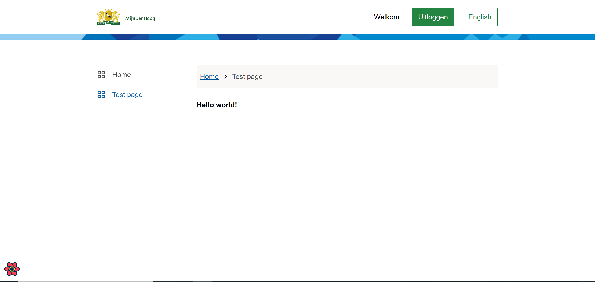
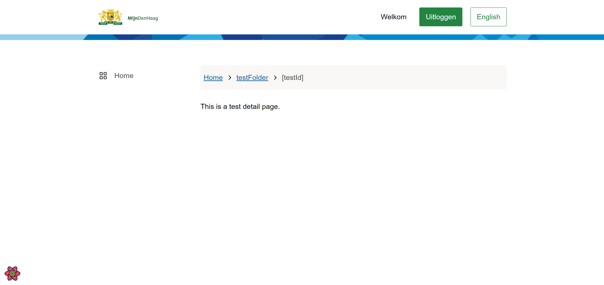

# Development of the Skeleton Application

This page consists of the following parts:

- Adding an overview page
- Adding a detail page

These steps require you to: 
- Spin up the [front-end of the application](./docs/frontend.md).
- Spin up the [backend](./docs/backend.md)

---

## _Adding an overview page_

<strong>An overview page is meant for each unique meaning of a term (or topic).
Or they provide free navigation guides for a topic and include a headline, a short definition.
</strong>

A new page can be added with the following steps:

- Create a new .tsx file for your page at `cd pwa/src/pages/{folder-name}.tsx`:  @TODO refer to documentation about tsx files

> **_NOTE_**
> The breadcrumbs are automatically generated, but in most cases this leads to user unfriendly names. Fortunately we can change the names through the gatsby configuration file.

> **_NOTE_** 
> When creating a folder gatsby expects an index.tsx or index.ts file to render the page

- Then you can add a template to the page (this is not necessary but makes the code base clean and organized)
  - Create a new folder under `cd pwa/src/templates/{folder-name}`
    - Create a .tsx file `cd pwa/src/templates/{folder-name}/{File-name}.tsx` @TODO refer to documentation about tsx files
    - Create a .module.css file `cd pwa/src/templates/{folder-name}/{File-name}.module.css` (if necessary) @TODO refer to documentation about module.css files
- When adding content to the page we first need to know which template we are going to use
  - opsomming templates
  - See this doc @TODO need to write documentation about the different template types and refer to that
- Then we need to know what kind of page we want to add
  - opsomming soorten pages
  - See this doc @TODO need to write documentation about the different template types and refer to that

As an example we will create a folder and file called: 
```bash
# creating a folder
cd pwa/src/templates/PetStore

# creating a .tsx file
cd pwa/src/templates/petStore/PetStore.tsx

# creating an optional .module.css file
cd pwa/src/templates/petStore/PetStore.module.css
```

Now that we have created the page and template we need to add the template as an import to the page.

The code of the page `cd pwa/src/pages/petStore.tsx` file looks like this:
```Javascript
// cd pwa/src/pages/petStore.tsx
import * as React from "react";
import { DashboardTemplate } from "../templates/dashboard/DashboardTemplate";
import { TestTemplate } from "../templates/testFolder/TestTemplate";

const TestPage: React.FC = () => {
  return (
    <DashboardTemplate>
      <TestTemplate />
    </DashboardTemplate>
  )
};

export default TestPage;
```

The code of the `cd pwa/src/templates/petStore/PetStore.tsx` file looks like this:
```Javascript
// cd pwa/src/templates/petStore/PetStore.tsx
import * as React from "react";

export const TestTemplate: React.FC = () => {
  return (
    <h4>Hello world!</h4>
  );
};
```

Now we only have to add a sidenav item for this page to navigate to it. 
This can be done in the DashboardTemplate. There is a const menuItems, here you can add a new item.

The menuItems const should look like this
```Javascript
// cd pwa/src/templates/dashboard/DashboardTemplate.tsx
const menuItems: MenuItem[] = [
  { label: t("Home"), href: "/", current: pathname === "/", icon: <GridIcon /> },
  { label: t("Test page"), href: "/testFolder", current: pathname === "/testFolder", icon: <GridIcon /> }
];
```

Now navigate to localhost:8000 then click on the sideNav item 'Test page'
You should see this:



---

## _Adding a detail page_

<strong>A detail page is meant for a part of a unique topic.</strong>

A new detail page can be added with the following steps:

- Create a new folder under `cd pwa/src/pages/{folder-name}` 

> **_NOTE_**
> The breadcrumbs are automatically generated, but in most cases this leads to user unfriendly names. Fortunately we can change the names through the gatsby configuration file.

> **_NOTE_**
> When creating a folder gatsby expects an index.tsx or index.ts file to render the page

- Add the page you created at _Adding an overview page_ to the folder we just created `cd pwa/src/pages/petStore.tsx`
- Create a new `cd pwa/src/pages/{folder-name}/index.ts` file to the folder. @TODO refer to explanation .ts file
  - In this file we are going to import and export the overview page we created `cd pwa/src/pages/petStore.tsx`
    - @TODO explanation index file import/export
    - The code should look like this:
```Typescript
// cd pwa/src/pages/test/index.ts
import TestPage from "./test";

export default TestPage;
```

The added folders and files and their structure are now:

```bash
# creating a folder
cd pwa/src/pages/petStore

# adding cd pwa/src/pages/petStore.tsx to the folder above
cd pwa/src/pages/petStore/petStore.tsx

# creating an index.ts file
cd pwa/src/pages/petStore/index.ts
```

Restart the development server and go to localhost:8000/petStore
- control + C
- npm i 
- npm start

You will see the same result as above. 

Now it's time to add the detail page
- Create a new folder under the folder we just created `cd pwa/src/pages/{folder-name}/[fileId]`

> **_NOTE_**
> The parentheses around the `fileId` makes gatsby see this as a variable
>
> **_NOTE_**
> The breadcrumbs are automatically generated, but in most cases this leads to user unfriendly names. Fortunately we can change the names through the gatsby configuration file.


- Create a new page `cd pwa/src/pages/{folder-name}/[fileId]/{file-name}.tsx`
- Create a new template folder `cd pwa/src/templates/{folder-name}`
- Create a new template .tsx file `cd pwa/src/templates/{folder-name}/{file-name}.tsx`
  - Import the template file `cd pwa/src/templates/{folder-name}/{file-name}.tsx` in the detail page `cd pwa/src/pages/{folder-name}/[fileId]/{file-name}.tsx` we added
- Create a new `cd pwa/src/pages/{folder-name}/[fileId]/index.ts` file to the folder. @TODO refer to explanation .ts file
  - In this file we are going to import and export the detail page we created `cd pwa/src/pages/{folder-name}/[fileId]/{file-name}.tsx`
    - @TODO explanation index file import/export

Restart the development server and go to localhost:8000/petStore/{someId}

> **_NOTE_**
> {someId} can be anything @TODO more explanation slug detail page

- control + C
- npm i
- npm start



To change the breadcrumbs we will go to the `cd pwa/src/gatsby-config.js` file
Go to the gatsby-plugin-breadcrumb block in the file. 
Under options, you can add an array crumbLabelUpdates.
Within that you can add an object with pathName and crumbLabel. 
For the pathName we can add the folder name as it is. crumbLabel will be the outcome.

Here we will edit the breadcrumbs of the two pages we just created.

```Typescript
// cd pwa/gatsby-config.js
crumbLabelUpdates: [
  {
    pathname: "/petStore",
    crumbLabel: "Pet store",
  },
  {
    pathname: "/petStore/[petStoreId]",
    crumbLabel: "Pet store detail page",
  },
]
```

Restart the development server. The breadcrumbs should look like this. 


---

## Adding components to your page

Now that you've added the two pages, we can add components to those pages.
[click here to see the guide](./components.md).

---
